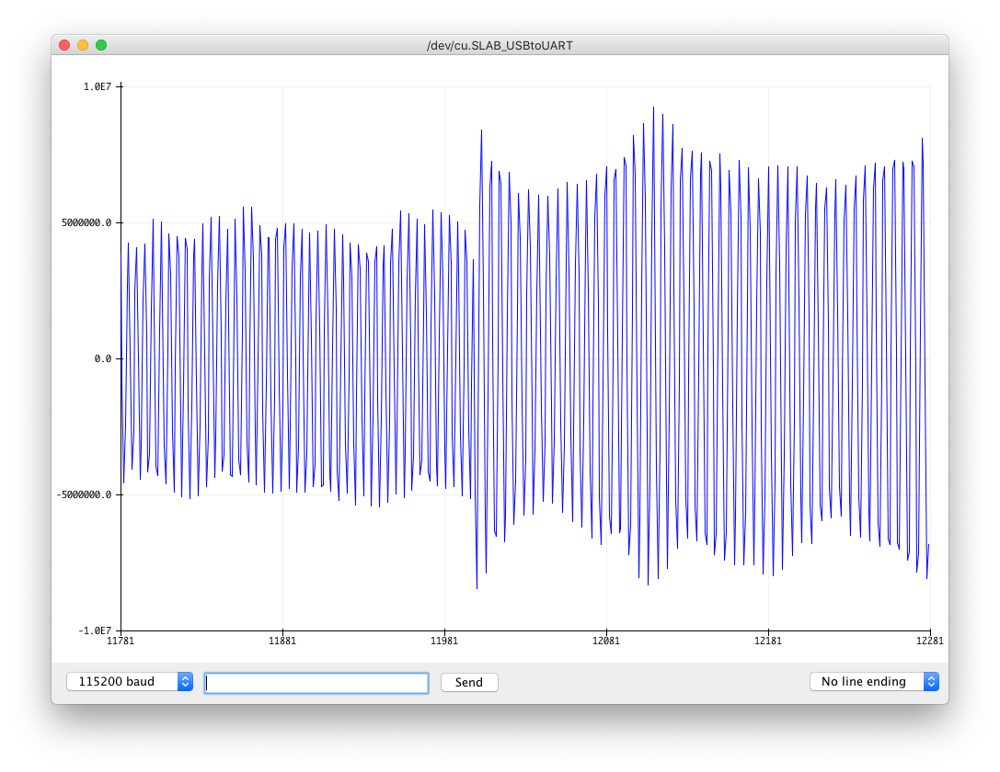

# The Simplest Test Code for an I2S Microphone on the ESP32 I can Imagine

[](https://ko-fi.com/Z8Z734F5Y)

I've got a lot of audio projects. And I've tried to make these all available on GitHub.

You can see all my projects here: [atomic14](https://www.youtube.com/channel/UC4Otk-uDioJN0tg6s1QO9lw) - please take a look and subscribe if you like them!

Quite a few of the issues I get on the projects seem to boil down to people having problems with their microphones. This is understandable - there's a lot to take in on some of the projects as they are pretty complicated.

It can be hard to tell if the problem is with the microphone, the code, or something completely unrelated.

Without actually recording and playing back the audio, it's hard to know what the problem is.

It's easy if you have an amplifier and speaker - but that's just adding another failure point. Is it the microphone or the speaker that is the problem?

We can play audio directly back via the ADC through headphones - but again, this is another failure point.

I think the most minimal thing we can do is to use the serial plotter in Arduino. This should work for everyone without any issues and is a very simple test.

Open this sketch up using the Arduino IDE and hit run. Now go to Tools->Serial Plotter.

There's only a few lines of code that you will need to change:

```c++
#define I2S_MIC_SERIAL_CLOCK GPIO_NUM_26
#define I2S_MIC_LEFT_RIGHT_CLOCK GPIO_NUM_22
#define I2S_MIC_SERIAL_DATA GPIO_NUM_21
```

# Wiring up the INMP441

This is a popular cheap microphone with readily available breakout board
|INMP441 | ESP32| Info|
|---|---|---|
|VDD|3v3|Power - DO NOT USE 5V!|
|GND|GND|GND|
|L/R|GND|Left channel or right channel|
|WS|22|Left right clock|
|SCK|26|Serial clock|
|SD|21|Serial data|

# Wiring up the ICS-43434

This is a better microphone (IMHO) with a less popular breakout board that I sell... [Available Here](https://www.tindie.com/products/21519/)
|ICS43434 | ESP32| Info|
|---|---|---|
|VDD|3v3|Power - DO NOT USE 5V!|
|GND|GND|GND|
|LR|GND|Left channel or right channel|
|WS|22|Left right clock|
|SCK|26|Serial clock|
|SD|21|Serial data|

Feel free to change the pins - but make sure you adjust the code to match.

You should see a waveform that looks like this if you whistle (if you can't whistle - try screaming 😱).



Once you've got your microphone up and running, here are some projects that you might enjoy: [Audio Project Playlist](https://www.youtube.com/playlist?list=PL5vDt5AALlRfGVUv2x7riDMIOX34udtKD)
